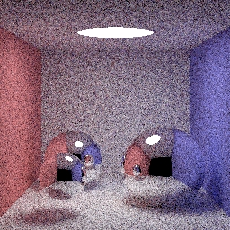

smallpt
=======

to make smallpt bigger

Currenlt the repos has:
* [Kevin Beason](http://www.kevinbeason.com/smallpt/)'s original version
* David Cline's version with [a ppt of full explanation](https://docs.google.com/file/d/0B8g97JkuSSBwUENiWTJXeGtTOHFmSm51UC01YWtCZw)
* [Milo Yip](http://www.cnblogs.com/miloyip/archive/2010/06/23/cpp_vs_cs_GI.html)'s version with xnamath/SIMD accelaration
* My cpp version, more object-oriented and has more *planned* features
* My hlsl version, runnable on [HlslShaderToy](https://github.com/vinjn/HlslShaderToy)

